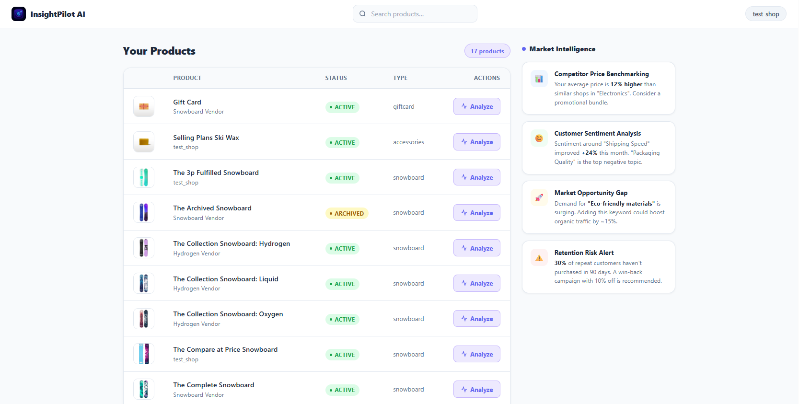
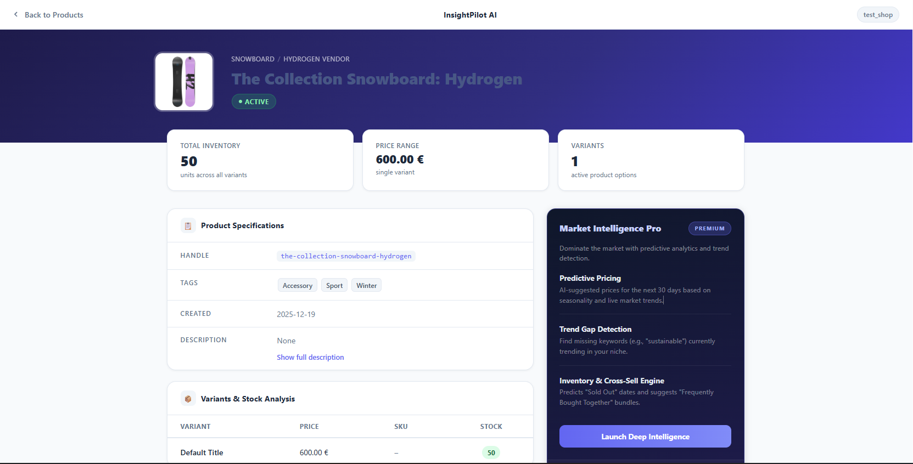
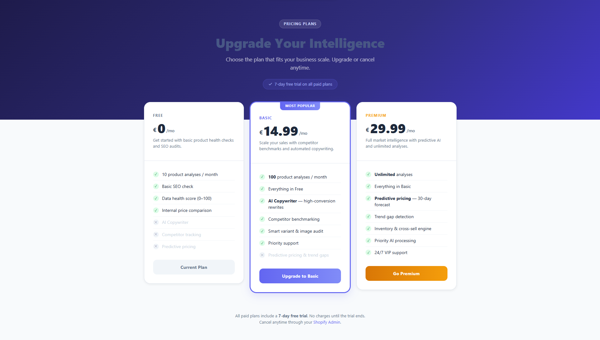

# InsightPilot AI

> AI-powered product analytics for Shopify merchants — embedded directly in the Shopify Admin.

InsightPilot AI is a Shopify embedded app that gives merchants a clear view of their product data: inventory, pricing, SEO health, and AI-driven market insights — all without leaving the Shopify Admin.

---

## Screenshots

### Product Dashboard


### Product Analysis


### Pricing & Plans


---

## Features

- **Product Dashboard** — Browse your entire product catalog with real-time status and inventory
- **Product Analysis** — Per-product deep-dive: variants, stock levels, specs, tags, and descriptions
- **Plan-gated AI Insights** — Free, Basic, and Premium tiers with progressively more powerful AI features
- **Billing Integration** — Shopify recurring charges with 7-day free trial via the Shopify Billing API
- **Market Intelligence** — Competitor benchmarking, sentiment analysis, and retention alerts (Premium)

---

## Tech Stack

| Layer | Technology |
|---|---|
| Backend | Django 6.0 |
| Shopify Integration | ShopifyAPI 12.7.0 |
| Auth | Shopify OAuth 2.0 |
| Billing | Shopify Recurring Application Charges |
| Frontend | Bootstrap 5, vanilla JS |
| Database | SQLite (dev) |
| Environment | python-dotenv |

---

## Local Setup

### 1. Clone the repo

```bash
git clone https://github.com/Rehajel15/InsightPilot-AI.git
cd InsightPilot-AI
```

### 2. Create and activate a virtual environment

```bash
python -m venv venv

# Windows
venv\Scripts\activate

# macOS / Linux
source venv/bin/activate
```

### 3. Install dependencies

```bash
pip install -r requirements.txt
```

### 4. Configure environment variables

Create a `.env` file in the project root:

```env
SECRET_KEY=your-django-secret-key
DEBUG=True
ALLOWED_HOSTS=localhost,127.0.0.1,your-ngrok-subdomain.ngrok-free.app

APP_DOMAIN=your-ngrok-subdomain.ngrok-free.app

SHOPIFY_API_KEY=your-shopify-api-key
SHOPIFY_API_SECRET=your-shopify-api-secret
SHOPIFY_APP_URL=https://your-ngrok-subdomain.ngrok-free.app
SHOPIFY_SCOPES=read_products,write_products,read_checkouts,write_checkouts
```

> You get `SHOPIFY_API_KEY` and `SHOPIFY_API_SECRET` from the [Shopify Partner Dashboard](https://partners.shopify.com) after creating an app.

### 5. Apply migrations

```bash
python manage.py migrate
```

### 6. Start the development server

```bash
python manage.py runserver
```

---

## Shopify + ngrok Setup

Shopify requires a publicly accessible HTTPS URL to load the app in its Admin iframe. Use [ngrok](https://ngrok.com) to tunnel your local server:

```bash
ngrok http 8000
```

Copy the `https://....ngrok-free.app` URL and:

1. Set it as `APP_DOMAIN` and `SHOPIFY_APP_URL` in your `.env`
2. Add it to **App URL** and **Allowed redirection URL(s)** in the Shopify Partner Dashboard:
   - App URL: `https://your-subdomain.ngrok-free.app/`
   - Redirect URL: `https://your-subdomain.ngrok-free.app/auth/callback`

Then install the app on your development store via:
```
https://your-subdomain.ngrok-free.app/auth/login?shop=your-store.myshopify.com
```

---

## Project Structure

```
InsightPilot-AI/
├── authentication/        # Shopify OAuth, ShopifyStore model
├── billing/               # Pricing page, Shopify recurring charges, webhooks
├── core/                  # Product dashboard, product analysis, error page
├── InsightPilot_AI/       # Django project settings, URLs, middleware
├── static/                # Bootstrap 5, JS, images
├── data/                  # error_codes.json
└── .env                   # Secrets — never committed
```

---

## Plans & Pricing

| Feature | Free | Basic (€14.99/mo) | Premium (€29.99/mo) |
|---|:---:|:---:|:---:|
| Product analyses / month | 10 | 100 | Unlimited |
| Basic SEO check | ✓ | ✓ | ✓ |
| Data health score | ✓ | ✓ | ✓ |
| AI Copywriter | ✗ | ✓ | ✓ |
| Competitor benchmarking | ✗ | ✓ | ✓ |
| Predictive pricing | ✗ | ✗ | ✓ |
| Trend gap detection | ✗ | ✗ | ✓ |
| Priority AI processing | ✗ | ✗ | ✓ |

All paid plans include a **7-day free trial**.

---

## Environment Variables Reference

| Variable | Description |
|---|---|
| `SECRET_KEY` | Django secret key |
| `DEBUG` | `True` for local dev, `False` in production |
| `ALLOWED_HOSTS` | Comma-separated list of allowed hosts |
| `APP_DOMAIN` | Your public domain (ngrok or production) |
| `SHOPIFY_API_KEY` | From Shopify Partner Dashboard |
| `SHOPIFY_API_SECRET` | From Shopify Partner Dashboard |
| `SHOPIFY_APP_URL` | Full HTTPS URL of your app |
| `SHOPIFY_SCOPES` | Comma-separated Shopify API scopes |
